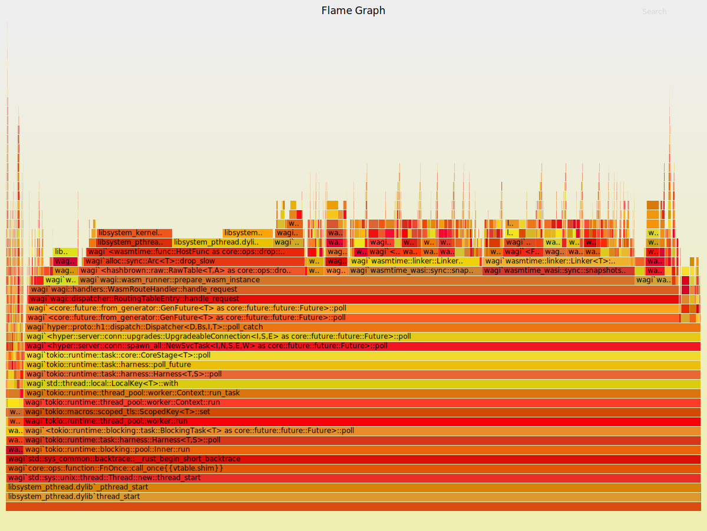
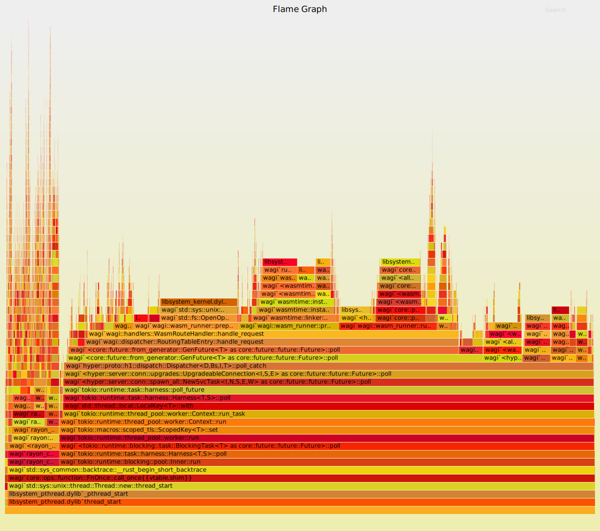

# Knative-WAGI

This is the experimental project to build WebAssembly application for Knative.

The ```Dockerfile-with-cache``` provide the sample Docker image build with WAGI with some enhancements.

Details in https://github.com/denverdino/wagi/tree/with_cache

* Performance optimization by caching the compiled WASM context
* Handle the SIGTERM properly for graceful shutdown


The original flamegraph for wagi 0.8.1



The flamegraph after performance optimization



## Run WAGI in Knative

After [installing Knative](https://knative.dev/docs/install/), you can give a try for WAGI examples
    
```
$ kubectl apply -f knative_test.yaml
$ kubectl get ksvc autoscale-wagi
NAME             URL                                                LATESTCREATED          LATESTREADY            READY   REASON
autoscale-wagi   http://autoscale-wagi.default.127.0.0.1.sslip.io   autoscale-wagi-00002   autoscale-wagi-00002   True
$ curl http://autoscale-wagi.default.127.0.0.1.sslip.io
Oh hi world
$ curl http://autoscale-wagi.default.127.0.0.1.sslip.io/hello
hello world
```

## More for WAGI: WebAssembly Gateway Interface

* https://github.com/deislabs/wagi
* https://www.fermyon.com/blog/wasm-wasi-wagi

